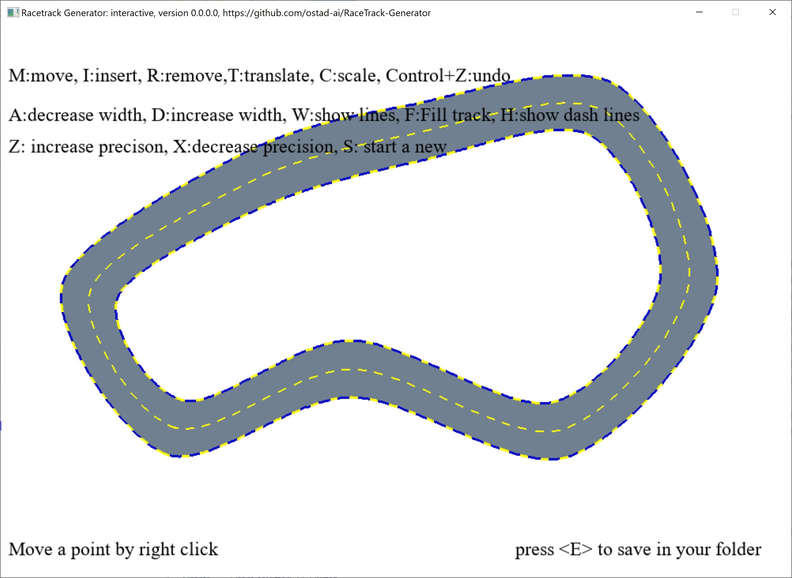

# RaceTrack Generator
### Newest: version 0.0.0.0
1. An interactive 2D race track generator.
## This archive includes the executable program, rtgenerator.exe, which you should click on to run.
### By clicking on key e, you save the track as an image and as a pickle file which includes points on the track. 
[Download the archive for win64](https://drive.google.com/file/d/1T7Yw0H7cXoU9BI-MUyhL1XH5NqFpqRkv/view?usp=share_link)
---
 *Figure 1: A snapshot of RaceTrackGenerator.*
---