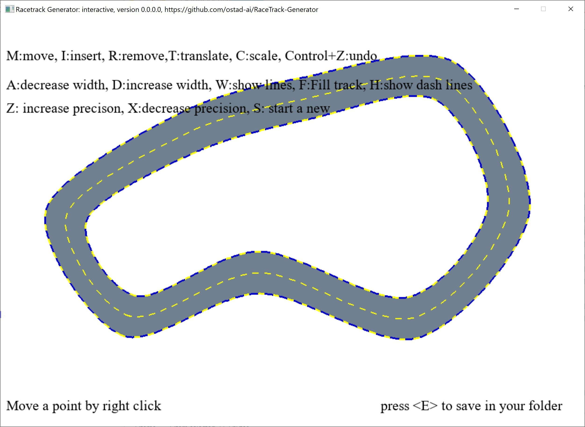
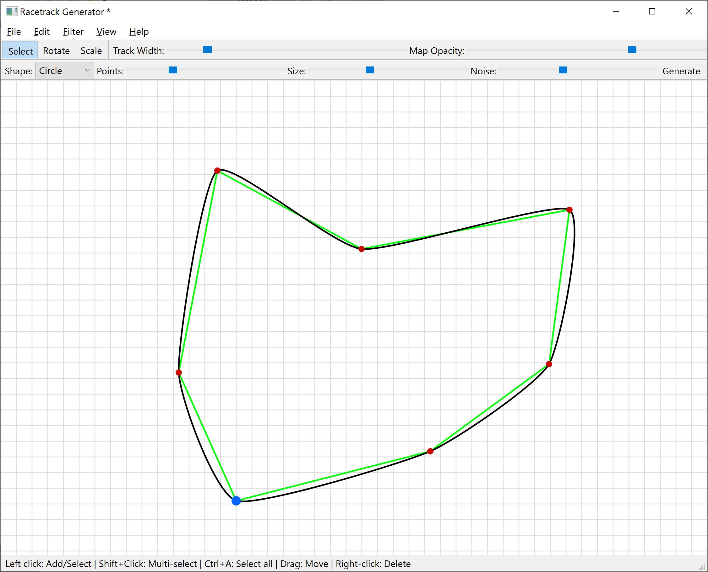

#  🏁 RaceTrack Generator
### Newest: version 0.1
A professional, procedural spline-based racetrack design tool. Whether you are building a racing game, simulating AI vehicle physics, or just designing tracks for fun, this tool provides an infinite canvas and powerful math utilities to bring your roads to life.

This is the **v0.1 release** (an upgraded version of the initial v0.0 proof-of-concept), featuring a rebuilt UI, infinite canvas, Perlin noise generation, and advanced track filters.

---

<table>
<tr>
<td>
Figure 1: A snapshot of the first version of the app: RaceTrack Generator, version 0.0.</td>
<td>
Figure 2: A snapshot of the current version of the app: RaceTrack Generator, version 0.1.</td>
</tr>
</table>
---

## 📥 Download the App (Windows)

The main application is provided as a standalone Windows executable for Windwos 10 and over. You don't need Python installed to use it!

**[⬇️ Download TrackDesigner.exe](https://drive.google.com/file/d/1C3x2QA_ddOBRKkr11NBcINAHK4yGuyWh/view?usp=sharing)**

1. Download the `.exe` file.
2. Double-click to run.
3. Start designing your tracks and export them as JSON!

---

## ✨ Features

- **Infinite Canvas:** Smooth zoom and pan (Mouse Wheel to zoom, Spacebar + Left-Click to pan).
- **Spline-Based Editing:** Add, drag, and delete control points. The track is generated dynamically using cardinal splines.
- **Transform Tools:** Select multiple points to move, rotate, or scale track sections. 
- **Grid & Snapping:** Toggleable background grid with `Alt`-key snapping for precise track layouts.
- **Procedural Generation:** Generate base tracks (Circle, Ellipse, Rectangle, Triangle, Star) using seamless Perlin noise to create organic, windings roads.
- **Advanced Filters:** 
  - Smooth, Subdivide (add points), Simplify (remove points).
  - Relax (equalize point spacing).
  - Perturb (inject Perlin noise into existing points).
  - Mirror X/Y and Reverse direction.
  - *All filters can be applied globally or to a local selection of points!*
- **Background Map Tracing:** Import a game map or satellite image, adjust its opacity, and trace your track directly over it.
- **Project Management:** Save and Load `.track.json` project files.
- **JSON Export:** Export the final `inner`, `outer`, and `center` lines to a standard JSON file for your game engine.

---

## 💻 For Developers: Python API & Demo

To use the tracks exported by the app in your own Python games, we provide the following files in this repository:

### 1. `track_tools.py` (The API)
A lightweight, pure-Python helper file to load your exported JSON tracks into your own games. It contains the `RaceTrack` class.
* **Usage:**
  ```python
  from track_tools import RaceTrack

  track = RaceTrack("racetrack.json")
  print(f"Track length: {track.length}")
  
  # Find the nearest point on the track to a specific X, Y coordinate
  nearest_idx, distance_from_center = track.get_nearest_point(150, 200)
  
  # Get a point a few steps ahead for AI steering
  target_x, target_y = track.get_lookahead_point(150, 200, look_ahead_count=3)
  ```

### 2. `demo_dynamic_seek.py` (The AI Demo)
A fully runnable demo built with **Pygame** that demonstrates how to use the `track_tools.py` API. It features a vehicle that uses **Dynamic Seek Steering Behavior** to automatically follow the track.
* **To run:** 
  1. `pip install pygame`
  2. Export a track as `racetrack.json` from the main app.
  3. Run `python demo_dynamic_seek.py`.
* **Controls:** 
  * `UP Arrow`: Accelerate
  * `DOWN Arrow`: Brake / Reverse
  * `ESC`: Exit
  *(The AI handles all the steering automatically!)*

---

## 📜 Version History

- **v0.1 (Current)**
  - Rebuilt UI with infinite canvas (zoom/pan).
  - Added Perlin noise procedural generation.
  - Added local/global track filters (smooth, subdivide, perturb, etc.).
  - Added background map import for tracing.
  - Added `track_tools.py` API and `demo_dynamic_seek.py` AI demo.
- **v0.0 (Initial)**
  - Basic fixed-canvas spline track generator.

---

## 🌟 Support

If RaceTrack Generator helps you build your dream racing game, please consider supporting us by giving this repository a ⭐ on GitHub! It helps other developers discover the tool and fuels our future updates (and our virtual chai ☕).

---

## ❤️ Credits

Developed by Hamed Shah-Hosseini, under the Veis star (with lots of virtual chai). ☕

Built with Math, Pygame, and a passion for game development.
